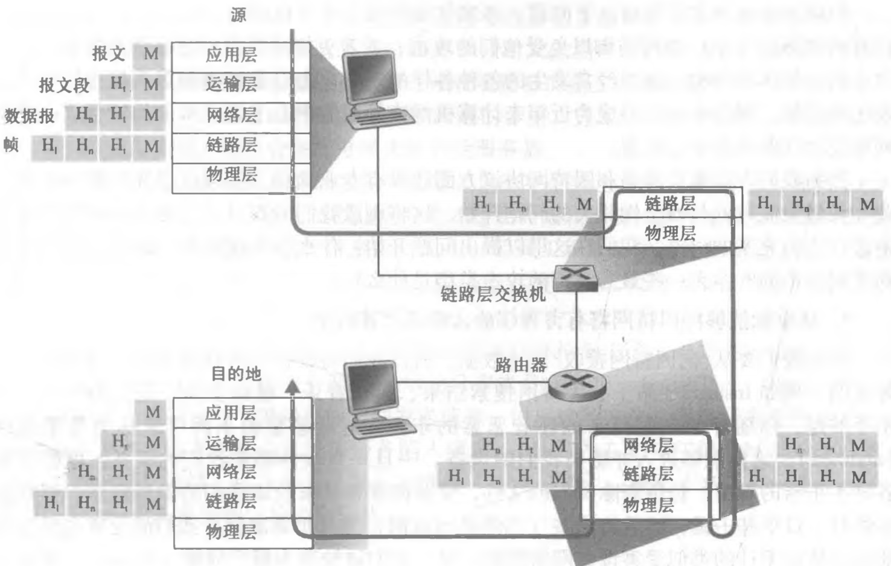

### 计算机网络和因特网

1. 什么是因特网
2. 网络边缘
3. 网络核心
4. 分组交换网中的时延、丢包和吞吐量
5. 协议层次及其服务模型

#### 1.1 什么是因特网

##### 1.1.1 具体构成描述

因特网是一个世界范围互联数十亿计算设备(端系统/主机)的网络。

端系统通过通信链路(communication link)和分组交换机(packet switch)连接到一起，通过因特网服务提供商(Internet Service Provider,ISP)接入因特网。

分组交换机从它的一条入通信链路接受到达的分组，并从它的一条出通信链路转发该分组。两种著名的交换机类型是路由器(router)和链路层交换机(link-layer switch)。

##### 1.1.2 服务描述

因特网是为分布式应用程序(distributed application)提供服务的基础设施。

与英特网相连的端系统提供一个套接字接口(socket interface)，该接口规定了运行在一个端系统上的程序请求因特网基础设施向运行在另一个端系统上的特定目的地程序交付数据的方式。

##### 1.1.3 协议

协议(protocol)定义了在两个或多个通信实体之间交换报文的格式和顺序，以及报文发送和/或接受一条报文或其它事件所采取的动作。

#### 1.2 网络边缘

与因特网相连的计算设备称为端系统(主机)，它们位于因特网的边缘。

主机进一步划分为客户(client)和服务器(server)。

##### 1.2.1 接入网

接入网是指将端系统物理连接到其边缘路由器的网络。边缘路由器是端系统到任何其它远程端系统路径上的第一台路由器。

1. 家庭接入：通过 数字用户线 DSL(Digital Subscriber Line)和电缆 接入因特网。和光纤到户(Fiber To The Home,FTTH)

2. 企业和家庭接入：使用局域网(LAN)将端系统接入到边缘路由器。包括以太网和 WIFI 。

3. 广域无线接入：第三/四代无线技术(3G/4G)

##### 1.2.2 物理媒体

传输的比特从源到目的地通过一系列的 发射-接受 跨越的物理媒体。

#### 1.3 网络核心

网络核心是由互联所有因特网端系统的分组交换机和链路构成的网状网络。

通过网络链路和交换机移动数据有两种方法：电路交换(circuit switching)和分组交换(packet switching)。

##### 1.3.1 分组交换

在各种网络应用中，端系统彼此交换报文(message)，为了从源端系统向目的端系统发送一个报文，源将长报文划分为较小的数据块，称之为分组(packet)。在源和目的地之间，每个分组都通过通信链路和分组交换机传送。

1. 存储转发传输

存储转发传输是指在交换机开始向输出链路传输该分组的第一个比特之前，必须接收到该分组的所有比特。在接收到最后一个比特之前，还不能传输已经接收的比特，必须先存储该分组的其它比特。

2. 排队时延和分组丢失

每台分组交换机有多条链路与之相连，对于每条相连的链路，该分组交换机具有一个输出缓存(output buffer，也称为输出队列(output queue))，它用于存储路由器准备发往那条链路的分组。

如果到达的分组需要传输到某条链路，但该链路正忙于传输之前到达的分组，该分组必须在输出缓存中等待。因此除存储转发时延以外，分组还要承受输出缓存的排队时延(queuing delay)。

缓存空间的大小是有限的，一个到达的分组发现该缓存已被其它等待传输的分组完全充满了，在此情况下，将出现分组丢失(丢包，packet loss)，到达的分组或已经排队的分组之一将被丢弃。

3. 转发表和路由选择协议

在因特网中，每个端系统有一个称为IP地址的地址。当源主机要向目的端系统发送一个分组时，源在该分组的首部包含了目的地的IP地址。如同邮政地址那样，该地址具有一种等级结构。

当一个分组到达网络中的路由器时，路由器检查该分组的目的地址的一部分，并向一台相邻路由器转发该分组。每台路由器具有一个转发表(forwarding table)，用于将目的地址(或目的地址的一部分)映射成为输岀链路。当某分组到达一台路由器时，路由器检查该地址，并用这个目的地址搜索其转发表，以发现适当的出链路。路由器则将分组导向该出链路。

##### 1.3.2 电路交换

在电路交换网络中，端系统间在通信会话期间，预留了端系统间沿路径通信所需要的资源(缓存，链路传输速率)，用于创建一条专用的端到端连接。在分组交换网络中，这些资源是不预留的，也不会创建专用的连接。

电路交换网络中的复用：链路中的电路通过频分复用(Frequency-Division Multiplexing，FDM)和时分复用(Time-Division Multiplexing，TDM)来实现。

对于一条 FDM 链路，链路的频谱由跨越链路创建的所有连接共享。在连接期间。链路为每条连接专用一个频段。该频段的宽度称为带宽(band-width)。

对于一条 TDM 链路，时间被划分为固定期间的帧，并且每个帧又被划分为固定数量的时隙。
当网络跨越一条链路创建一条连接时，网络在每个帧中为该连接指定一个时隙。这些时隙专门由该连接单独使用，一个时隙（在每个帧内）可用于传输该连接的数据。
对于TDM，一条电路的传输速率等于帧速率乘以一个时隙中的比特数量。

#### 1.4 分组交换网中的时延、丢包和吞吐量

##### 1.4.1 分组交换网中的时延概述

分组从源主机出发，通过一系列路由器的传输，到达目的主机，分组在沿途的每个节点经受了几种不同类型的时延，其中最重要的是节点处理时延(nodal processing delay)、排队时延(queuing delay)、传输时延(transmission delay)和传播时延(propagation delay)，这些时延的总和是节点总时延(total nodal delay)。

1）处理时延：检查分组的首部和决定将该分组导向哪条出链路所需要的时间是处理时延的主要部分。

2）排队时延：分组到达分组交换机之后在输出队列中等待传输的时间即排队时延。

3）传输时延：传输时延是路由器将分组的比特推向链路所需要的时间，它是分组长度和链路传输速率的函数。

4）传播时延：比特被推向链路后，在连接起点路由器和终点路由器的物理媒体上传播所需要的时间，它是两台路由器之间距离的函数。

##### 1.4.2 排队时延和丢包

设`a`表示分组到达队列的平均速率(分组/s、pkt/s)，`R`是传输速率，即路由器从队列中推出比特的速率(bps、b/s)，所有的分组都是由`L`比特组成。则比特到达队列的平均速率是 `La`bps，`La/R`称为流量强度(traffic intensity)。

当流量强度接近1时，路由器的输出队列已满，再到达分组时，路由器将丢弃(drop)该分组，即该分组将丢失(lost)。

##### ~~1.4.3 端到端时延~~

##### ~~1.4.4 计算机网络中的吞吐量~~

#### 1.5 协议层次及其服务模型

##### 1.5.1 分层的体系结构

为了给网络协议的设计提供一个结构，网络设计者以分层(layer)的方式组织以及实现这些协议的网络硬件和软件。一个协议层能够用软件、硬件或二者的结合来实现。

各层的所有协议被称为协议栈(protocol stack)，因特网的协议栈由5个层次组成：应用层、运输层、网络层、链路层、物理层。

1. 应用层

应用层是网络应用程序及它们的应用层协议存留的地方。应用层协议分布在多个端系统上，一个端系统中的应用程序使用协议与另一个端系统中的应用程序交换信息分组，我们把位于应用层的信息分组称为报文(message)。

2. 运输层

因特网的运输层在应用程序端点之间传送应用层报文。运输层的分组称为报文段(segment)。因特网中有两种运输协议：TCP和UDP。
TCP协议向它的应用程序提供面向连接的服务，包括应用层报文向目的地的确保传递和流量控制，将长报文划分为短报文，并提供拥塞控制机制。
UDP协议向它的应用程序提供无连接服务，这是一种不提供不必要服务的服务，没有可靠性，没有流量控制，没有拥塞控制。

3. 网络层

网络层负责将称为数据报(datagram)的网络层分组从一台主机移动到另一台主机。因特网运输层协议向网络层递交运输层报文段和目的地址。网络层包含著名的网际协议IP和一些路由选择协议。

4. 链路层

为了将分组从一个节点移动到路径上的下一个节点，网络层必须依靠链路层的服务。网络层受到来自每个不同链路层协议的不同服务。链路层分组称为帧(frame)。

5. 物理层

链路层的任务是将整个帧从一个网络元素移动到邻近的网络元素，而物理层的任务是将该帧中的一个个比特从一个节点移动到下一个节点。这层中的协议仍然是链路相关的，并且进一步与该链路(如：双绞铜线、单模光纤)的实际传输媒体相关。

##### 1.5.2 封装

在发送主机端，一个应用层报文（application-layer message）(M)被传送给运输层。在最简单的情况下，运输层收取到报文并附上附加信息（运输层首部信息）(H~1~)，该首部将被接收端的运输层使用。应用层报文和运输层首部信息一道构成了运输层报文段（transport-layer segment）。
运输层报文段因此封装了应用层报文。附加的信息也许包括了下列信息：允许接收端运输层向上向适当的应用程序交付报文的信息；差错检测位信息，该信息让接收方能够判断报文中的比特是否在途中已被改变。
运输层则向网络层传递该报文段，网络层增加了如源和目的端系统地址等网络层首部信息(H~n~)，生成了网络层数据报（network-layer datagram）。该数据报接下来被传递给链路层，链路层增加它自己的链路层首部信息并生成链路层帧（link-layer frame）。链路层将链路层帧交付给物理层传输。
所以我们看到，在每一层，一个分组具有两种类型的字段：首部字段和有效载荷字段（payload field）。有效载荷通常是来自上一层的分组。

