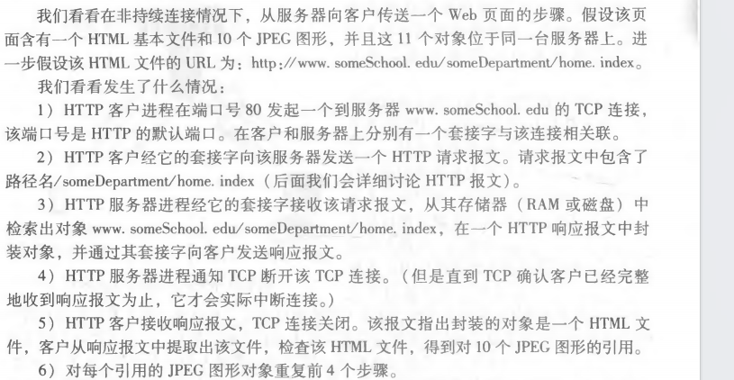

## 应用层

1. 应用层协议原理
2. Web 和 HTTP
3. 因特网中的电子邮件
4. NDS：因特网的目录服务
5. P2P 文件分发
6. 视频流和内容分发网
7. 套接字编程：生成网络应用

### 2.1 应用层协议原理

网络应用是计算机网络存在的理由，研究网络应用程序的核心是写出能够运行在不同的端系统和通过网络彼此通信的程序。

#### 2.1.1 网络应用程序体系结构

应用程序体系结构（区别于因特网体系结构）由应用程序研发者设计，规定了如何在各种端系统上组织该应用程序。包括：客户-服务器体系结构和P2P体系结构。

#### 2.1.2 进程通信

进行通信的实际上是进程(process)。在两个不同端系统上的进程，通过跨越计算机网络交换 报文(message)而相互通信。

~~1. 客户和服务器进程~~

2. 进程与计算机网络之间的接口

进程通过一个称为套接字(socket)的软件接口向网络发送报文和从网络接收报文，套接字是一台主机内应用层与运输层之间的接口。应用程序开发者可以控制套接字在应用层端的一切，但是对该套接字的运输层端几乎没有控制权，对运输层的控制仅限于：选择运输层协议和设置少许参数。

3. 进程寻址

在一台主机上运行的进程为了向在另一台主机上运行的进程发送分组，为了标识接收进程，需要定义两种信息：目的主机的地址、在目的主机中指定接收进程的标识符。主机由 IP地址 标识，接收进程由端口号(port number)标识。

#### 2.1.3 可供应用程序使用的运输服务

当开发一个应用时，必须选择一种可用的运输层协议，一个运输层协议能够为调用它的应用程序提供哪些服务，从4个方面对应用程序的服务要求进行分类：可靠数据传输、吞吐量、定时和安全性。

1. 可靠数据传输：一个协议提供发送端发送的数据正确、完整的交付到接收端这样的确保数据交付服务。
2. 吞吐量：运输层协议能够以特定的速率提供确保的可用吞吐量。
3. 定时：发送方注入进套接字中的每个比特到达接收方套接字所需的时间不超过指定的值。
4. 安全性：运输层协议在发送方加密，在接收方解密。

#### 2.1.4 因特网提供的运输服务

因特网为应用程序提供两个运输层协议：TCP 和 UDP。每个协议为调用它们的应用程序提供了不同的服务集合。

1. TCP 服务

TCP 服务模型提供面向连接服务和可靠数据传输服务。当某个应用程序调用 TCP 作为运输协议时，该程序能获得这两种服务。

面向连接的服务：在应用层数据报文开始流动之前，TCP让客户和服务器互相交换运输层控制信息，即握手。在握手阶段后，一个TCP连接在两个进程的套接字之间建立了，这条连接是全双工的，在应用程序结束报文发送后，必须拆除该连接。

可靠的数据传送服务：通信进程能够依靠TCP，无差错、按适当顺序交付所有发送的数据，没有字节错位、丢失和冗余。

2. UDP 服务

UDP 是一种不提供不必要服务的轻量级运输协议，它仅提供最小服务，UDP是无连接的，两个进程通信前没有握手过程。UDP 协议提供不可靠数据传输服务，没有拥塞控制。

#### 2.1.5 应用层协议

应用层协议(application-layer protocol)定义了运行在不同端系统上的应用程序进程如何相互传递报文，特别是：

* 交换的报文类型，例如请求报文和响应报文；
* 各种报文类型的语法，如报文中的各个字段及这些字段是如何描述的；
* 字段的语义，即这些字段中的信息的含义；
* 确定一个进程何时以及如何发送报文，还有对报文进行响应的规则。

应用层协议只是网络应用的一部分。区分应用层协议和运输层协议。如：Web 的应用层协议是 HTTP，使用运输层的 TCP服务。

### 2.2 Web 和 HTTP

#### 2.2.1 HTTP 概况

Web 的应用层协议是超文本传输协议(HyperText Transfer Protocol，HTTP)。HTTP 由两个程序实现：一个客户程序和一个服务器程序，它们运行在不同的端系统中，通过交换 HTTP 报文进行会话。HTTP 使用 TCP 作为它的支撑运输协议。

#### 2.2.2 非持续连接和持续连接

在许多因特网应用程序中，客户和服务器在一个相当长的时间范围内通信，其中客户发出一系列请求并且服务器对每个请求进行响应，这一系列请求可以以规则的间隔周期性地或者间断性地一个接一个发出，并且客户-服务器的交互是经 TCP 进行的。每个请求/响应对可以经一个单独的 TCP 连接发送，则称该应用程序使用非持续连接(non-persistent connection)；或者所有的请求及其响应经相同的 TCP 连接发送，那么该应用程序被称为使用持续连接(persistent connection)。

1. 采用非持续连接的 HTTP

2. 采用持续连接的 HTTP

采用持续连接的情况下，服务器在发送响应后保持该 TCP 连接的打开，在相同的客户与服务器之间，后续的请求和响应报文能够通过相同的连接进行传送。如果一条连接经过一定时间间隔仍未被使用，HTTP 服务器就关闭该连接。

#### 2.2.3 HTTP 报文格式

HTTP 规范包含了对 HTTP 报文格式的定义，包括请求报文和响应报文。

1. HTTP 请求报文

一个典型的 HTTP 请求报文包括 5 行，每行由一个回车和换行符结束，最后一行再附加一个回车换行符。

第一行是请求行(request line)，包括3个字段：方法字段、URL字段和 HTTP版本字段。方法字段可以取不同的值：GET、POST、HEAD、PUT和DELETE。

请求行后面的是首部行(header line)。首部行`Host: www.someschool.edu`指明了对象所在的主机，首部行`Connection close`告诉服务器不使用持续连接，首部行`User-agent`用来指明用户代理，即向服务器请求的浏览器的类型，首部行`Accept-language`指明用户想要得到的语言版本。

一个 HTTP 请求报文的通用格式：

2. HTTP 响应报文

第 1 行是初始状态行(status line)，包括 3 个字段：协议版本字段、状态码和相应状态信息。

第 2~5 行是首部行，`COnnection close`首部行告诉客户该报文发送完后将关闭该 TCP 连接，`Data`首部行指示服务器产生并发送该响应报文的日期和时间，`Server`首部行指示该报文是由一台 Apache Web服务器产生的，它类似于 HTTP 请求报文中的 "User-agent" 首部行，`Last-Modified`首部行指示对象创建或最后修改的日期和时间，`Content-Length`首部行指示了被发送对象的字节数，`Content-Type`首部行指示了实体提中的对象是 HTML 文件。

第 6 行是实体体(entity body)，它包含了所请求的对象本身。

一个 HTTP 响应报文的通用格式：

补充：状态码和响应状态信息的含义：

#### ~~2.2.4 用户和服务器的交互：cookie~~

#### 2.2.5 Web 缓存

Web 缓存器(Web cache)也叫代理服务器，它是能够代表初始 Web服务器来满足 HTTP 请求的网络实体。Web 缓存器有自己的磁盘存储空间，并在存储空间中保存最近请求过的对象的副本。

当配置用户的浏览器，使得用户的所有 HTTP 请求首先指向 Web 缓存器后，用户浏览器产生 HTTP 请求时：

#### 2.2.6 条件 GET 方法

使用高速缓存能减少用户感受到的响应时间，但存放在缓存器中的对象副本可能是陈旧的。HTTP 协议采用条件 GET(conditional GET)方法。如果请求报文使用GET方法，并且请求报文中包含一个"If-Modified-Since:"首部行，那么这个 HTTP 请求报文就是一个条件GET请求报文。

### ~~2.3 因特网中的电子邮件~~

#### ~~2.3.1 SMTP~~

#### ~~2.3.2 与 HTTP 的对比~~

#### ~~2.3.3 邮件报文格式~~

#### ~~2.3.4 邮件访问协议~~

### 2.4 NDS：因特网的目录服务

主机的一种标识方法是主机名(hostname)，如www.google.com。为了便于路由器处理，主机使用IP地址(IP address)进行标识。

#### 2.4.1 DNS 提供的服务

人们喜欢便于记忆的主机名标识，路由器喜欢定长的、有层次结构的IP地址，为了折中，需要一种能进行主机名到IP地址转换的目录服务，即域名系统(Domain Name System)。DNS是：一个由分层的DNS服务器实现的分布式数据库、一个使得主机能够查询分布式数据库的应用层协议。DNS协议运行在UDP之上，通常被其它应用层协议所使用。

#### 2.4.2 DNS 工作机理概述

假设运行在用户主机上的某些应用程序需要将主机名转换为IP地址，这些应用程序将调用DNS客户端，并指明需要被转换的主机名。用户主机上的DNS接收到后，向网络中发送一个DNS查询报文，经过若干时间的时延后，用户主机上的DNS接收到一个包含该主机名映射的IP地址的DNS回答报文，这个映射结果被传递到调用DNS的应用程序。

#### 2.4.3 DNS 记录和报文

共同实现DNS分布式数据库的所有DNS服务器存储了资源记录(Resourse Record，RR)，RR提供了主机名到IP地址的映射，每条DNS回答报文包含了一条或多条资源记录。

资源记录是一个包含了4个字段的4元组：(Name，Value，Type，TTL)。TTL决定该资源记录在缓存中删除的时间，Name和Value的值取决于Type。

DNS只有查询报文和回答报文，且两种报文有相同的格式。DNS报文中各字段的语义如下：

### ~~2.5 P2P 文件分发~~

### ~~2.6 视频流和内容分发网~~

#### ~~2.6.1 因特网视频~~

#### ~~2.6.2 HTTP 流和 DASH~~

#### ~~2.6.3 内容分发网~~

### ~~2.7 套接字编程：生成网络应用~~

#### ~~2.7.1 UDP 套接字编程~~

#### ~~2.7.2 TCP 套接字编程~~
