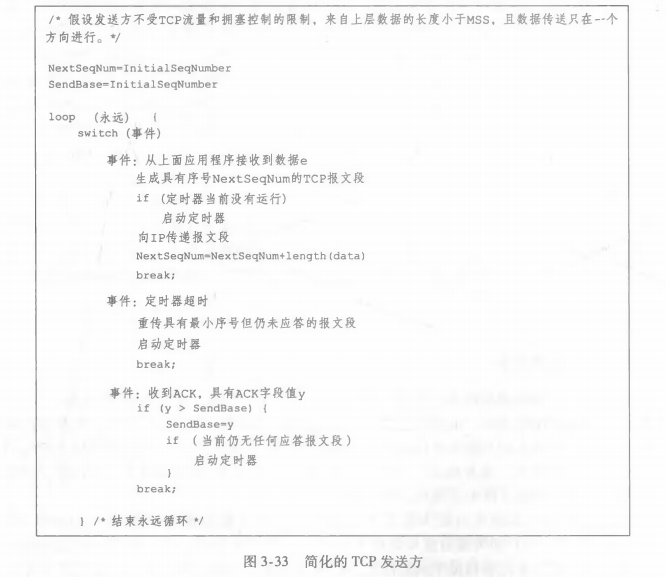
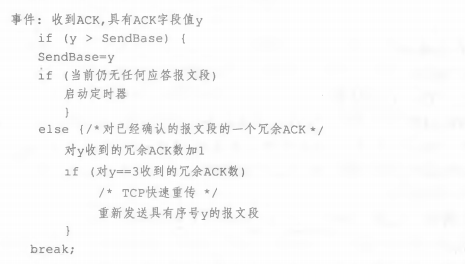

## 运输层

1. 概述和运输层服务
2. 多路复用和多路分解
3. 无连接运输：UDP
4. 可靠数据传输原理
5. 面向连接的运输：TCP
6. 拥塞控制原理
7. TCP 拥塞控制

### 3.1 概述和运输层服务

运输层协议为运行在不同主机上的应用进程之间提供了逻辑通信功能，运输层协议是在端系统中而不是路由器中实现的。

#### 3.1.1 运输层和网络层的关系

网络层提供了主机之间的逻辑通信，运输层是为运行在不同主机上的进程提供逻辑通信。

即使底层的网络协议不能在网络层提供相应的服务，运输层协议也能提供某些服务。

#### 3.1.2 因特网运输层概述

TCP 和 UCP 最基本的责任是：将两个端系统间 IP 的交付服务扩展为运行在端系统上的两个进程之间的交付服务。将主机间交付扩展到进程间交付被称为运输层的多路复用(transport-layer multiplexing)和多路分解(demultiplexing)。

### 3.2 多路复用和多路分解

多路复用：在源主机从不同套接字中收集数据块，并为每个数据块封装上首部信息，从而生成报文段，然后将报文段传递到网络层。

多路分解：每个运输层报文段有几个字段，在接收端，运输层检查这些字段，标识出接收套接字，进而将报文段定向到该套接字。

运输层多路复用要求：套接字有唯一的标识符；每个报文段有特殊字段来指示该报文段所要交付到的套接字，这些特殊字段是源端口号字段和目的端口号字段。端口号是一个16比特的数。

一个 UDP 套接字由一个二元组(目的IP地址，目的端口号)标识。一个 TCP 套接字由一个四元组(源IP地址，源端口号，目的IP地址，目的端口号)标识。

### 3.3 无连接运输：UDP

运输层最低限度必须提供一种复用/分解服务，以便在网络层与正确的应用级进程之间传递数据。由[RFC 768]定义的 UDP 只是做了运输层协议能够做的最少工作，除了复用/分解功能及少量的差错检测外，它几乎没有对IP增加别的东西。

使用 UDP 时，在发送报文段之前，发送方和接收方的运输层实体之间没有握手，即 UDP 是无连接的。与 TCP 不同，UDP 无需在端系统中维护连接状态。

UDP 的优点是：关于发送什么数据以及何时发送应用层控制更为精细、传输数据前无须建立连接、传输时是无连接状态的、分组首部开销小。

注意：UDP 不提供不必要的服务，但使用 UDP 的应用可以实现可靠数据传输。

#### 3.3.1 UDP 报文段结构

UDP 报文首部只有4个字段，每个字段由两个字节组成，应用层数据填充到 UDP 报文段的数据字段。

通过端口号可以使目的主机将应用数据交付给运行在目的端系统中的相应进程，长度字段指示在 UDP 报文段中的字节数（首部加数据），接收方使用检验和来检查在该报文段中是否出现了差错。

#### 3.3.2 UDP 检验和

UDP 检验和提供了差错检测功能（原理略），但它对差错恢复无能为力，UDP 的某种实现是丢弃受损的报文段，其它实现是将受损的报文段交给应用程序并给出警告。

### 3.4 可靠数据传输原理

可靠数据传输协议(reliable data transfer protocol)为上层实体提供的服务抽象为：数据可以通过一条可靠信道进行传输，尽管可靠数据传输协议的下层协议也许是不可靠的。

在发送端，通过调用 rdt_send() 函数，上层可以调用数据传输协议的发送方，它将要发送的数据交付给位于接收方的较高层（rdt 表示可靠数据传输协议，udt 表示不可靠数据传输）。在接收端，当分组从信道的接收端到达时，将调用 rdt_rcv()，当 rdt 协议想要向较高层交付数据时，将通过调用 deliver_data() 来完成。

#### 3.4.1 构造可靠数据传输协议

1. 经完全可靠信道的可靠数据传输：rdt1.0

假设底层信道是可靠的，称该协议是 rdt1.0。下图是 rdt1.0 发送方和接收方的有限状态机(Finite-State Machine，FSM)。

发送端和接收方有各自的 FSM，FSM 描述图中的箭头指示了协议从一个状态变迁到另一个状态，rdt1.0 的发送发和接收方都只有一个状态，因此变迁是从一个状态返回到自身。
引起变迁的事件显示在表示变迁的横线上方，事件发生时所采取的动作显示在横线下方。
如果对一个事件没有动作，或没有就事件发生采取一个动作，则在横线上方或下方使用符号`^`，以分别明确表示缺少动作或事件。
FSM 的初始状态用虚线表示。

rdt 的发送端只通过 rdt_send(data) 事件接受来自较高层的数据，产生一个包含该数据
的分组（经由make_pkt(data)动作），并将分组发送到信道中。实际上，rdt_send(data) 事件是由较高层应用的过程调用产生的（例如，rdt_send()）。

在接收端，rdt 通过 rdt_rcv(packet) 事件从底层信道接收一个分组，从分组中取岀数据（经由 extract(packet, data)动作），并将数据上传给较高层（通过d eliver_data( data)动作）。实际上，rdt_rcv(packet) 事件是由较低层协议的过程调用产生的（例如，rdt_rcv()）。

在这个简单的协议当中，有完全可靠的信道，接收端就不需要提供任何反馈信息给发送方。

2. 经具有比特差错信道的可靠数据传输：rdt2.0

底层信道更为实际的模型是分组中的比特可能受损的模型，而且要求发送的分组将按其发送的顺序被接受。

在报文协议中使用肯定确认(positive acknowledgement，ACK)和否定确认(negative acknowledgement，NCK)，这些控制分组使得接收方可以让发送方知道哪些内容被正确接收，哪些内容接收有误并因此需要重复，这种基于重传机制的可靠数据传输协议被称为自动重传请求协议(Automatic Pepeat reQuest，ARQ)。

ARQ 协议还需要其它三种协议功能来处理存在的比特差错的情况：差错检测、接收方反馈和重传。

下图是 rdt2.0 的FSM，该数据传输协议采用了差错检测、肯定确认和否定确认。

rdt2.0 协议存在一个致命的缺陷：没有考虑 ACk 或 NCK 分组受损的可能性。处理受损的 ACK 和 NCK 有两个问题：发送方不能理解接收方返回的控制分组的意思、接收方不能理解一个接收的分组是新的分组还是一次重传。

解决方法是在数据分组中添加一个新字段，让发送方对其数据分组进行编号，将发送数据分组的序号(sequence number)放在该字段。接收方只需要检查序号即可确定收到的分组是一个新分组还是一个重传分组。对于停等协议这种简单情况，1比特序号就足够了，用模2 运算前向移动。序号相同是重传的分组，序号变化是新分组。

假定底层信道不丢失分组，因此 ACK 和 NCK 分组不需要指明它们要确认的分组的序号，发送方知道所接收到的 ACK 和 NCK 分组是为响应其最近发送的数据分组而生成的。改进后的 rdt 协议为 rdt2.1，下图是 rdt2.1 的 FSM 描述：

rdt2.1 的发送方和接收方 FSM 的状态数都是以前的两倍，因为协议状态此时必须反映出发送方目前正在发送的分组或接收方希望接收的分组的序号是 0还是1。

rdt2.2 是在有比特差错信道上实现一个无 NAK 的可靠数据传输协议，接收方必须包括由一个 ACK 报文所确认的分组序号，通过在接收方的 FSM 中在 make_pkt() 中包括参数 ACK0 或 ACK1 来实现，发送方必须检查接收到的 ACK 报文中被确认的分组序号，通过发送方 FSM 中在 isACK() 中包括参数 0或1 来实现。

3. 经具有比特差错的丢包信道的可靠数据传输：rdt3.0

实际上除了比特受损之外，底层信道还会丢包。协议现在必须处理两个问题：怎样检测丢包和发生丢包后该做什么。rdt2.2 中使用检验和、序号、ACK 分组和重传等，可以解决后一个问题，为了解决怎样检测丢包问题，还需要增加一种新的协议机制。

我们让发送方负责检测和恢复丢包工作。假设发送方传输一个数据分组，该分组的丢失或接收方对该分组的 ACK 发生丢失，发送方都不会收到应当到来的接收方的响应。发送方在等待一个时间值之后，就判定可能发生了丢包，这是就会重传该分组。

为了实现基于时间的重传机制，需要一个倒计时定时器，在一个给定的时间量期后，中断发送方，因此发送方需要做到：每次发送一个分组时便启动一个定时器；响应定时器中断；终止定时器。下图是 rdt3.0 发送方的 FSM：

因为分组序号在 0和1 之间交替，rdt3.0 有时被称为比特交替协议(alternating-bit protocol)。

注意：因为序号比特只有一位，分组序号是在 0 1 之间交替，发送方传输时是：分组0，分组1，分组0...。因此注意：发送分组1 之后，接着发送下一个分组0 和重传上一个分组0 的区别。

#### 3.4.2 流水线可靠数据传输协议

rdt3.0 是一个正确的协议，但是它采用了停等协议，导致它的效率不够高。

一个解决方式是不以停等方式运行，允许发送方发送多个分组，而无须等待确认之后再发送下一个分组。从发送方向接收方输送的分组可以被看成是填充到一条流水线中，故这种技术被称为流水线(pipelining)。流水线技术对可靠数据传输协议带来如下影响：

- 必须增加序号范围，因为每个分组必须有一个唯一的序号，而且也许有多个在输送中的未确认报文。
- 协议的发送方和接收方也许不得不缓存多个分组。发送方最低限度应当能缓冲那些已发送但没有确认的分组，接收方或许也需要缓存那些已经正确接收的分组。
- 所需序号范围和对缓冲的要求取决于数据传输协议如何处理丢失、损坏和延时过大的分组。解决流水线的差错恢复有两种基本方法：回退 N 步(Go-Back-N，GBN)和选择重传(Selective Repeat，SR)。

#### 3.4.3 回退 N 步

在回退 N 步(GBN)协议中，允许发送方发送多个分组而无须等待第一个发送的分组的回答报文到达，但也受限于在流水线中未确认的分组数不能超过某个最大允许数 N。

将基序号(base)定义为最早未确认分组的序号，将下一个序号(nextseqnum)定义为最小的未使用序号（即下一个待发送分组的序号），则可将序号范围分割成4段：在 [0, base - 1] 段内的序号对应于已经发送并被确认的分组，[base, nextseqnum - 1] 段内对应已经发送但未被确认的分组，[nextseqnum, base + N - 1] 段内的序号能用于那些要被立即发送的分组，最后，大于或等于 base + N 的序号是不能使用的，直到当前流水线中未
被确认的分组（特别是序号为base的分组）已得到确认为止。

N 被称为窗口长度。下图是一个基于 ACK，无 NAK 的 GBN 协议的发送方和接收方的 FSM：

GBN 的发送方必须响应三种类型的事件：

- 上层的调用。当上层调用 rdt.send() 时，发送方首先检查发送窗口是否已满，即是否有N个已发送但未被确认的分组。如果窗口未满，则产生一个分组并将其发送，并相应地更新变量。如果窗口已满，发送方只需将数据返回给上层，隐式地指示上层该窗口已满。然后上层可能会过一会儿再试。在实际实现中，发送方更可能缓存（并不立刻发送）这些数据，或者使用同步机制（如一个信号量或标志）允许上层在仅当窗口不满时才调用 rdt.send()。
- 收到一个ACK。在 GBN 协议中，对序号为 n 的分组的确认采取累积确认(cumulative acknowledgment)的方式，表明接收方已正确接收到序号为 n 的以前且包括 n 在内的所有分组。
- 超时事件。协议的名字 “回退N步” 来源于出现丢失和时延过长分组时发送方的行为。就像在停等协议中那样，定时器将再次用于恢复数据或确认分组的丢失。如果出现超时，发送方重传所有已发送但还未被确认过的分组。发送方仅使用一个定时器，它可被当作是最早的已发送但未被确认的分组所使用的定时器。如果收到一个 ACK，但仍有已发送但未被确认的分组，则定时器被重新启动。如果没有已发送但未被确认的分组，停止该定时器。

在 GBN 的接收方，如果一个序号为 n 的分组被正确接受到，并且按序（即上次交付给上层的数据是序号为 n-1 的分组），则接收方为分组 n 发送一个 ACK。在其它所有情况下，接收方丢弃该分组，并为最近按序接收的分组重新发送 ACK。

在 GBN 协议中，接收方丢弃所有失序分组，因为发送方根据 GBN重传规则，会重传丢失分组后面所有的未确认分组。

#### 3.4.4 选择重传

GBN 协议允许发送方发送多个分组，避免了停等协议带来的信道利用率问题，但是 GBN 协议本身也有一些情况存在性能问题，尤其是当窗口长度和带宽时延都很大时，单个分组的差错就会导致大量分组的重传。

选择重传(SR)协议通过让发送发仅重传那些它怀疑在接收方出错（丢失或受损）的分组从而避免不必要的重传。这种个别的、按需的重传要求接收方逐个地确认正确接收的分组。

SR 接收方将确认一个正确接收的分组而不管其是否按序，失序的分组将被缓存直到所有丢失分组（即序号更小的分组）都被收到为止，这是才可以将一批分组按序交付给上层。

### 3.5 面向连接的运输：TCP

TCP 是因特网运输层的面向连接的可靠的运输协议，它依赖于上一节的许多基本原理，包括差错检测、重传、累积确认、定时器以及用于序号和确认号的首部字段。

#### 3.5.1 TCP 连接

TCP 被称为是面向连接的(connection-oriented)，这是因为在一个应用进程可以开始向另一个应用进程发送数据之前，这两个进程必须先相互 "握手"，即它们必须互相发送某些预备报文段，以建立确保数据传输的参数。作为 TCP 连接建立的一部分，连接的双方都将初始化与 TCP 连接相关的许多 TCP 状态变量。

TCP "连接" 是一条逻辑连接，其共同状态仅保留在两个通信端系统的 TCP 程序中。TCP 协议只在端系统中运行，而不在中间的网络元素（路由器和链路层交换机）中运行，所以中间的网络元素不会维持 TCP 连接状态，中间的网络元素对连接完全视而不见，它们看到的是数据包，而不是连接。

客户首先发送一个特殊的 TCP报文段，服务器用另一个特殊的 TCP报文段来响应，最后客户再用第三个特殊的报文段作为响应。前两个报文段不承载有效载荷，也就是不包含应用层数据，而第三个报文段可以承载有效载荷。由于这两台主机之间发送了3 个报文段，所以这种连接建立过程被称为三次握手(three-way handshake)。

一旦建立起一条 TCP 连接，两个应用进程之间就可以互相发送数据了，客户进程通过套接字传递数据流。数据一旦通过套接字，就由客户中运行的 TCP 控制，TCP 将这些数据引导到该连接的发送缓存(sned buffer)里，发送缓存是发起三次握手期间设置的缓存之一。接下来 TCP 从发送缓存中取出一块数据，并配上一个 TCP 首部，从而形成一个 TCP 报文段，然后将报文段传递到网络层。

TCP 连接的组成包括：一台主机上的缓存、变量和与进程连接的套接字，以及另一台主机上的另一组缓存、变量和与进程连接的套接字。

TCP 可从缓存中取出并放入报文段中的数据数量受限于最大报文段长度(Maximum Segment Size，MSS)，MSS 通过根据最初确定的由本地主机发送的最大链路层帧长度（即最大传输单元(Maximum Transmission Unit，MTU)）来设置。

#### 3.5.2 TCP 报文段结构

TCP 报文段由首部字段和一个数据字段组成。数据字段包含一块应用数据。

TCP 的首部一般是 20 字节，与 UDP 一样，首部包括了源端口号和目的端口号，被用于多路复用/分解来自或送到上层的应用数据，也包括检验和字段。此外，TCP 还包括：

- 32 比特的序号字段(sequence number field)和 32 比特的确认号字段(acknowledgement number field)。
- 16 比特的接收窗口字段(receive window field)，该字段用于流量控制。
- 4 比特的首部长度字段(header length field)，该字段指示了以 32 比特的字为单位的 TCP 首部长度。
- 可选和变长的选项字段(option field)，该字段用于发送发与接收方协商最大报文段长度时或在高速网络环境下用作窗口调节因子时使用。
- 6 比特的标志字段(flag field)。ACK 比特用于指示确认字段中的值是有效的，RST、SYN、FIN 比特用于连接的建立和拆除。

TCP 把数据看成是一个无结构的、有序的字节流，因为序号是建立在传送的字节流之上，而不是建立在传送的报文段的序列之上，因此一个报文段的序号是该报文段首字节的字节流编号。假定数据流由一个包含 500 000 字节的文件组成，其 MSS 为 1000 字节，数据流的首字节编号是 0，TCP 将为该数据构建 500 个报文段，给第一个报文段分配序号0，第二个报文段分配序号1000，第三个报文段分配序号2000，以此类推，每一个序号被填入到相应 TCP 报文段首部的序号字段中。

TCP 是全双工的，发送主机A 在向接收主机B 发送数据的同时，也许也接收来自主机B 的数据，从主机A 到达的每个报文段中都有一个序号用于从主机A 流向主机B 的数据。主机B 填充进报文段的确认号是主机B 期望从主机A 收到的下一字节的序号。

#### 3.5.3 往返时间的估计与超时

TCP 协议采用超时/重传机制，设置超时间隔长度是重要的。

1. 估计往返时间

报文段的样本 RTT（表示为 SampleRTT）是从某报文段被发出（即交给 IP）到对该报文段的确认分组被收到之间的时间量，在某时刻做一次 SmapleRTT 的测量，在任意时刻，仅为一个已发送但目前尚未被确认的报文段估计 SampleRTT，从而产生一个接近每个 RTT 的新 SampleRTT 值。

由于路由器的拥塞和端系统负载的变化，这些报文段的 Sample 值会随之波动，TCP 维持一个 Sample RTT 均值（称为 EstimatedRTT），一旦获得一个新 SampleRTT 时，TCP 就会根据下列公式来更新 EstimatedRTT：`EstimatedRTT = （1-a) * EstimatedRTT + a * SampleRTT`。[RFC 6298]中给出的 a 的推荐值是 a =0.125。

除了估算RTT 外，测量RTT 的变化也是有价值的，[RFC 6298]定义了RTT偏差 DevRTT，用于估算 SampleRTT 一般会偏离 EstimatedRTT 的程度：`DevRTT = (1-β) * DevRTT + β * |SampleRTT - EstimatedRTT|`。

2. 设置和管理重传超时间隔

TCP 超时间隔应该大于等于 EstimatedRTT，且不应该大太多。超时间隔 `TimeoutInterval = EstimatedRTT + 4 * DevRTT`。推荐的初始 TimeoutInterval 值为 1 秒，当出现超时后，TimeoutInterval 的值将加倍，以免即将被确认的后继报文段过早出现超时。同时，只要收到确认报文段并更新 EstimatedRTT，就会重新计算 TimeoutInterval。

#### 3.5.4 可靠数据传输

TCP 在 IP 不可靠的尽力而为的服务之上创建了一种可靠数据传输服务，TCP 的可靠数据传输服务确保一个进程从其接收缓存中读取的数据流是无损坏、无间隔、不冗余和按序的数据流。

定时器的管理需要相当大的开销，推荐的定时器管理过程仅使用单一的重传定时器，即使有多个已发送但还未确认的报文段。假设发送发只用超时来恢复报文段的丢失，下图是发送方的简化的描述：

1. 超时间隔加倍

2. 快速重传

超时触发重传存在的问题之一是超时周期可能相对较长，当一个报文段丢失时，这种长超时周期迫使发送方延迟重传丢失的分组，因此增加了端到端时延。幸运的时，发送方通常可在超时事件发生之前通过注意冗余ACK 来检测丢包情况。冗余ACK 就是再次确认某个报文段的 ACK，而发送方先前已经接收到对该报文段的确认。

当 TCP 接收方接收到一个序号大于下一个所期望的报文段时，说明有报文段丢失，因为 TCP 不适用否定确认，所以接收方不能向发送方发回一个显式的否定确认，相反，它只是对已经接收到的最后一个按序字节数据进行重复确认（即产生一个冗余ACK）即可。

因为发送方经常一个接一个的发送大量的报文段，如果一个报文段的丢失，就可能引起许多冗余ACK，如果发送发接收到对相同数据的 3 个冗余ACK，说明已被确认过 3 次的报文段之后的报文段已经丢失，TCP 将执行快速重传，即在该报文段的定时器过期之前重传丢失的报文段。

3. 是回退 N 步还是选择重传

TCP 是一个 GBN 协议还是一个 SR 协议？
TCP 确认是累积式的，正确接收但失序的报文段是不会被接收方逐个确认的。TCP 发送方仅需维持已发送过但未被确认的字节的最小序号和下一个要发送的字节的序号，此时 TCP 像一个 GBD 风格的协议。但是许多 TCP 实现会将正确接收但失序的报文段缓存起来，对 TCP 提出的一种修改意见是选择确认(selective acknowledgement)，它允许 TCP 接收方有选择的确认失序报文段，而不是累积地确认最后一个正确接收的有序报文段。当该机制与选择重传机制结合起来时（即跳过重传那些已被接收方选择性地确认过的报文段），TCP 看起来像 SR 协议。因此 TCP 的差错恢复机制被分类为 GBN 协议和 SR 协议的混合体。

#### 3.5.5 流量控制

TCP 为它的应用程序提供了流量控制服务(flow-control service)以消除发送发使接收方缓存溢出的可能性，流量控制服务使发送方的发送速率与接收方应用程序的读取速率相匹配（流量控制区别于拥塞控制）。

TCP 通过让发送方维护一个称为接收窗口(receive window)的变量来提供流量控制。即接收窗口用于给发送方一个指示：该接收方还有多少可用的缓存空间。因为 TCP 是全双工通信，在连接两端的发送方都各自维护一个接收窗口。假设主机A 通过一条TCP 连接向主机B 发送一个大文件。主机B 为该连接分配一个接收缓存，用`RevBuffer`表示其大小，主机B 上的应用进程不时地从该缓存中读取数据，我们定义：`LastByteRead`是主机B 上地应用进程从缓存读出地数据流中最后一个字节的编号。`LastByteRcvd`是从网络中到达的并且已放入主机B 接收缓存中的数据流的最后一个字节的编号。

由于TCP 连接不允许已分配的缓存溢出，下式必须成立：`LastByteRcvd - LastByteRead <= RcvBuffer`。接收窗口用`rwnd`表示，根据缓存可用空间的数量来设置：`rwnd = RcvBuffer - [LastByteRcvd - LastByteRead]`，该值是变化的。

主机B 通过把当前的rwnd 值放入它发送给主机A 的报文段接收窗口字段中，通知主机A 它在该连接的缓存中还有多少可用空间。开始时设定rwnd = RcvBuffer。

主机A 轮流跟踪两个变量：`LastByteSent`和`LastByteAcked`，它们的差值是主机A发送到连接中但未被确认的数据量，通过将该差值控制在值rwnd 之内，就可以保证主机A 不会使主机B 的接收缓存溢出。

#### 3.5.6 TCP 连接管理

1. 建立连接

客户主机上的一个进程想和服务器主机上的一个进程通信之前，会先建立一条TCP 连接。

第一步：客户端的TCP 首先向服务器端的TCP 发送一个特殊的TCP 报文段，该报文段不包含应用层数据，但是在报文段的首部中的一个标志位（SYN 比特位）被置为 1，因此这个特殊报文段被称为SYN 报文段。另外客户会随机的选择一个初始序号(client_isn)，并将此编号放置于该起始的TCP SYN 报文段的序号字段中。该报文段会被封装在一个IP 数据报中，并发送给服务器。

第二步：一旦TCP SYN 报文段的IP 数据报到达服务器主机，服务器会从该数据报中提取出TCP SYN 报文段，为该TCP 连接分配TCP 缓存和变量，并向该客户TCP 发送允许连接的报文段。这个允许连接的报文段也不包含应用层数据，但在报文段的首部包含了三个重要的信息：首先SYN 比特被置为 1，其次该TCP 报文段首部的确认号字段被置为 client_isn + 1，最后服务器选择自己的初始序号(server_isn)，并将其放置到TCP 报文段首部的序号字段中。该允许连接的报文段被称为 SYNACK 报文段。

第三步：在收到SYNACK 报文段后，客户也要给该连接分配缓存和变量，客户主机则向服务器发送另外一个报文段，这个报文段对服务器的允许连接报文段进行确认（客户通过将值 server_isn + 1 放置到TCP 报文段首部的确认字段中来完成此项工作）。因为连接已经建立了，所以SYN 比特位被置为 0。该三次握手的第三个阶段可以在报文段负载中携带客户到服务器的数据。

为了创建该连接，在两台主机之间发送了 3个分组，因此连接创建的过程通常被称为 3此握手(three-way handshake)。

2. 拆除连接

一条TCP 连接的两个进程中的任何一个都能终止该连接。假设客户想关闭连接，客户进程发出一个关闭连接命令，这会引起客户TCP 向服务器发送一个特殊的TCP 报文段，这个特殊的报文段让其首部中的FIN 标志位被置为 1，当服务器接收到该报文段后，就向客户回送一个确认报文段。然后服务器发送它自己的终止报文段，其FIN 标志位被置为 1，最后客户对这个服务器的终止报文段进行确认，自此连接结束。连接结束之后，主机中的资源（缓存和变量）将被释放。

在一个TCP 连接的生命周期内，运行在每台主机中的TCP 协议在各种TCP 状态之间变迁。

### 3.6 拥塞控制原理

#### 3.6.1 拥塞原因与代价

随着主机发送速率的增加，也许会导致网络变得拥堵。
网络拥塞的代价是：1）当分组的发送速率接近链路容量时，分组将经历巨大的排队时延；2）当出现分组丢失时，发送方必须执行重传以补偿因为缓存溢出而丢失的分组；3）发送方在遇到大时延时所进行的不必要重传会引起路由器利用其带宽来转发不必要的分组副本；4）当一个分组沿一条路径被丢弃时，每个上游路由器用于转发该分组到丢弃该分组而使用的传输容量最终被浪费掉了。

#### 3.6.2 拥塞控制方法

在最为宽泛的级别上，我们可根据网络层是否为运输层拥塞控制提供了显式帮助来区分拥塞控制方法。

1. 端到端拥塞控制

端到端拥塞控制方法中，网络层没有为运输层拥塞控制提供显式支持。端系统必须通过对网络行为的观察来推断，TCP 报文段的丢失（通过超时或 3次冗余确认而得知）被认为是网络拥堵的迹象，TCP 会相应的减小其窗口长度、

2. 网络辅助的拥塞控制

在网络辅助的拥塞控制中，路由器向发送方提供关于网络中拥塞状态的显式反馈信息。拥塞信息从网络反馈到发送方的方式有两种：直接反馈信息采用一个阻塞分组的形式直接由网络路由器发送给发送方；路由器标记或更新从发送方流向接收方的分组中的某个字段来指示拥塞的产生，接收到一个标记分组后，接收方会向发送方通知该网络拥塞指示。

### 3.7 TCP 拥塞控制

TCP 采用端到端拥塞控制，因为 IP 层不向端系统提供显式的网络拥塞反馈。TCP 采用的方法是让每一个发送方根据所感知到的网络拥塞程度来控制其能向连接发送流量的速率。

TCP 连接的每一端都是由一个接收缓存、一个发送缓存和几个变量(LastByteRead、rwnd等)组成。运行在发送方的TCP 拥塞控制机制跟踪一个额外的变量，即拥塞窗口(congestion window)，表示为 cwnd，它对一个 TCP发送方能向网络中发送流量的速率进行了限制，在一个发送方中未被确认的数据量不会超过 cwnd 和 rwnd 中的最小值。通过调节 cwnd 的值，发送方因此能调整它向连接发送数据的速率。

我们将一个 TCP 发送方的丢包事件定义为：要么出现超时，要么接收到来自接收方的 3 个冗余 ACK。当出现丢包事件时，发送方就认为在发送方到接收方的路径上出现了拥塞指示。

TCP 拥塞控制算法(TCP congestion control algorithm)用于当发送方感知到端到端的拥塞时改变其发送速率。该算法包括 3 个主要部分：慢启动、拥塞避免、快速恢复。

1. 慢启动

当一条 TCP 连接开始时，cwnd 的初始值设置为一个MSS。在慢启动过程中，cwnd 的值从一个MSS 开始倍增。当出现由超时指示的丢包事件时，TCP 发送方将 cwnd 的值重置为 1 并重新开始慢启动过程。当检测到拥塞时将 ssthresh（慢启动阈值）的值设置为 cwnd 的一半，继续发送，当 cwnd 的值等于 ssthresh 时，结束慢启动并且 TCP 转移到拥塞避免模式。如果检测到 3 个冗余的 ACK，这时 TCP 执行快速重传并进入快速恢复状态。

2. 拥塞避免

进入到拥塞避免状态，cwnd 的值大约是上次遇到拥塞时的值的一半，距离拥塞可能并不遥远。此时 TCP 无法每过一个 RTT 再将 cwnd 的值翻倍，而是只将 cwnd 的值增加 1 个MSS。当出现超时时，TCP 将 cwnd 的值设置为 1 个MSS，当丢包事件出现时，ssthresh 的值被更新为 cwnd 值的一半。当接收到 3 个冗余的 ACK 时，将 ssthresh 的值记录为 cwnd 的值的一半，进入到快速恢复状态。

3. 快速恢复

在快速恢复中，对于引起 TCP 进入快速恢复状态的缺失报文段，对收到的每个冗余的 ACK，cwnd 的值增加一个MSS。最终，当对丢失报文段的一个 ACK 到达时，TCP在降低 cwnd 后进入拥塞避免状态。如果出现超时事件，快速恢复在执行如同在慢启动和拥塞避
免中相同的动作后，迁移到慢启动状态：当丢包事件出现时，cwnd 的值被设置为 1 个
MSS，并且 ssthresh 的值设置为 cwnd 值的一半。

#### ~~3.7.1 公平性~~

#### ~~3.7.2 明确拥塞通告：网络辅助拥塞控制~~
