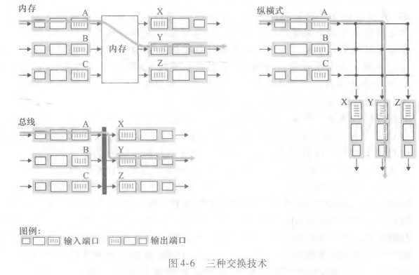

## 网络层：数据平面

1. 网络层概述
2. 路由器工作原理
3. 网际协议：IPv4、寻址、IPv6及其它
4. 通用转发和 SDN

网络层能被分解为两个相互作用的部分：数据平面和控制平面。

网络层的数据平面功能即网络层中每台路由器的功能，该数据平面功能决定到达路由器输入链路之一的数据报如何转发到该路由器的输出链路之一。

网络层的控制平面功能即网络范围的逻辑，该控制平面功能控制数据报沿着从源主机到目的主机的端到端路径中路由器之间的路由方式。

### 4.1 网络层概述

运输层依赖于网络层的主机到主机的通信服务。与运输层不同的时，在网络中的每一台主机和路由器都有一个网络层部分。

路由器的数据平面的主要作用是从其输入链路向其输出链路转发数据报，路由器的控制平面的主要任务是协调这些本地的路由器转发动作，使得数据报沿着源和目的主机之间的路由器路径最终进行端到端传送。路由器具有截断的协议栈，即没有网络层以上的部分。

#### 4.1.1 转发和路由选择：数据平面和控制平面

网络层的作用表面上看极其简单：将分组从发送主机移动到接收主机。为此，需要使用两种重要的网络层功能：

1. 转发。当一个分组到达某路由器的一条输入链路时，该路由器必须将该分组移动到适当的输出链路。转发是在数据平面中实现的唯一功能。
2. 路由选择。当分组从发送方流向接收方时，网络层必须决定这些分组所采用的路由或路径。计算这些路径的算法被称为路由选择算法(routing algorithm)。

转发和路由选择是不同的，转发(forwarding)是指将一个分组从一个输入链路接口转移到适当的输出链路接口的路由器本地动作。路由选择(routing)是指确定分组从源到目的地所采取的端到端路径的网络范围处理过程。

每台网络路由器中有一个关键元素是它的转发表(forwarding table)。路由器检查到达分组首部的一个或多个字段值，进而使用这些首部值在转发表中索引，找到合适的输出链路接口。

1. 控制平面：传统的方法

路由选择算法运行在每台路由器中，通过与其它路由器中的路由选择算法通信，计算出插入路由转发表中的内容。并且每台路由器中都包含转发和路由选择两种功能。

2. 控制平面：SDN 方法

远程控制器计算和分发转发表以供每台路由器所使用。上图和下图的数据平面组件是相同的，但在下图中，控制平面的路由选择功能和物理的路由器是分离的，即路由选择设备仅执行转发，而远程控制器计算并分发转发表。

#### 4.1.2 网络服务模型

网络层提供的服务模型：网络服务模型(network service model)定义了分组在发送与接收端之间的端到端运输特性。因特网的网络层提供单一的服务：尽力而为服务(best-effort service)。

约定术语 分组交换机 是指一台通用分组交换设备，它根据分组首部字段中的值，从输入链路接口到输出链路接口转移分组。一些分组交换机称为链路层交换机(link-layer switch)，基于链路层帧中的字段值做出转发决定，这些交换机是链路层设备；一些分组交换机称为路由器(router)，基于网络层数据报中的首部字段值做出转发决定，路由器是网络层设备。

### 4.2 路由器工作原理

通用路由器体系结构的总体视图，标识了一台路由器的 4 个组件，包括：输入端口、交换结构、输出端口、路由选择处理器。

在输入端口通过查询转发表决定路由器的输出端口，到达的分组通过路由器的交换结构转发到输出端口。控制分组（如携带路由选择协议信息的分组）从输入端口转发到路由选择处理器。

路由选择处理器执行控制平面功能，在传统的路由器中执行路由选择协议，维护路由选择表与关联链路状态信息，并为该路由器计算转发表，在 SDN 路由器中，路由选择处理器负责与远程控制器通信，目的是接收远程控制器计算的转发表项，并在该路由器的输入端口安装这些表项。

#### 4.2.1 输入端口处理和基于目的地转发

输入端口的线路端接功能与链路层处理实现了用于各个输入链路的物理层和链路层。

为了避免 IP 地址的规模问题，路由器用分组目的地址的前缀(prefix)与路由选择表中的表项进行匹配。当有多个匹配时，路由器使用最长前缀匹配规则。确定分组的输出端口后，该分组就能进入交换结构，如果其它分组正在使用交换结构，分组可能会被暂时阻塞，并在输入端口处排队。

#### 4.2.2 交换

交换结构位于一台路由器的核心部位，用于将分组实际的从一个输入端口交换（即转发）到输出端口。交换方式有经内存交换、经总线交换和经互联网交换三种。

#### 4.2.3 输出端口处理

输出端口处理取出已经存放在输出端口内存中的分组并将其发送到输出链路上，这包括选择和取出排队的分组进行传输、执行所需的链路层和物理层输出功能。

#### 4.2.4 如何处理排队

在输入端口和输出端口处都可以形成分组队列，随着队列的增长，路由器的缓存空间将被耗尽，当无内存用于存储到达的分组时将会出现丢包。分组 “在网络中丢失”或“被路由器丢弃” 就是在这里发生的。

1. 输入排队

如果交换结构不能快到使所有到达分组无时延的通过它传送（即分组到达速率大于交换速率），在输入端口将出现分组排队。这种现象叫做输入排队交换机中的线路前部(Head-Of-the-Line，HOL)阻塞，因为一个分组被位于线路前部的另一个分组所阻塞。

2. 输出排队

假设交换速率比连接输出端口的链路速率快 N 倍，有 N 个输入端口的分组转发到相同的输出端口，在向输出链路发送一个分组的时间内，将有 N 个分组到达该输出端口，其它的分组必须排队等待输出链路传输。

当没有足够的内存来缓存一个分组时，必须做出决定：要么丢弃到达的分组（弃尾(drop-tail)策略），要么删除一个或多个排队的分组为新来的分组腾出空间。在某些情况下，在缓存填满之前就丢弃一个分组（或在其首部加上标记）的做法是有利的，这可以向发送方提供一个拥塞信号，这种策略称为主动队列管理(Active Queue Management，AQM)算法。

#### 4.2.5 分组调度

假设有多个分组经交换处理后到达同一个输出端口的排队队列，此时选择哪个分组在链路上进行传输。

1. 先来先服务

2. 优先权排队

在优先权排队(priority queuing)规则下，到达输出链路的分组被分类放入输出队列中的优先权类。规则由网络管理员配置。

3. 循环和加权公平排队

在循环排队规则(round robin queuing discipline)下，分组像使用优先权排队那样被分类，但在类之间不存在严格的服务优先权，循环调度器在这些类之间轮流提供服务。

加权公平排队(weighting fair queuing，WFQ)和循环排队类似，但每个类被分配一个权重，用于决定该类的服务时间比例。

### 4.3 网际协议：IPv4、寻址、IPv6及其它

有两个版本的 IP（网际协议）正在使用：广泛部署的 IP版本4 (IPv4)，和逐渐发展的 IP版本6 (IPv6)。

#### 4.3.1 IPv4 数据报格式

网络层分组被称为数据报，IPv4 数据报格式为：

- 版本（号）。这 4 个比特规定了数据报的 IP 协议版本。
- 首部长度。因为一个 IPv4 数据报可包含一些可变数量的选项，故需要用这 4 个bite来确定 IP 数据报中的载荷（如这个数据报中被封装的运输层报文段）实际开始的地方。大多数 IP 数据报不包含 选项，所以一般的 IP 数据报具有 20 个字节的首部。
- 服务类型。服务类型(TOS)字段用于使不同类型的 IP 数据报能相互区别开来。
- 数据报长度。这是 IP 数据报的总长度（首部加上数据）。
- 标识、标志、片偏移。这三个字段与 IP分片有关。
- 寿命。寿命(Time-To-Live，TTL)字段用来确保数据报不会永远在网络中循环。每当一台路由器处理数据报时，该字段的值减1，若减为0，则该数据报必须丢弃。
- 协议。该字段通常仅当一个 IP 数据报到达其最终目的地时才会使用，该字段值指示了 IP 数据报的数据部分应交给哪个特定的运输层协议。协议号是将网络层和运输层绑定到一起的粘合剂，端口号是将运输层和应用层绑定到一起的粘合剂。
- 首部检验和。用于帮组路由器检测收到的 IP数据报中的首部 中的比特错误。如果路由器检测出比特错误，则丢弃该数据报。注意：IP 层只对 IP首部计算检验和，而 TCP/UDP 检验和是对整个 TCP/UDP 报文段进行的。
- 源和目的主机的 IP地址。
- 选项。选项字段允许 IP首部被扩展。
- 数据（有效载荷）。包含要交付给目的地的运输层报文段或其它类型数据。

如果数据报承载一个 TCP报文段，则这个数据报承载了总长 40字节的首部（20字节的 IP首部（假设无选项）和 20字节的 TCP首部）以及应用层报文。

#### 4.3.2 IPv4 数据报分片

注意到：并不是所有链路层协议都能承载相同长度的网络层分组，有的协议能承载大数据报，而有的协议只能承载小分组。一个链路层帧能承载的最大数据量叫做最大传送单元(Maximum Transmission Unit，MTU)。因为每个 IP数据报封装在链路层帧中从一台路由器传输到下一台路由器，故链路层协议的 MTU 严格的限制着 IP 数据报的长度。对 IP数据报长度具有严格限制不是主要问题，问题在于发送方与目的地路径上的每段链路可能使用不同的链路层协议，且每种协议可能具有不同的MTU。

假设某条出链路的 MTU比该 IP数据报的长度要小，解决方法是将 IP数据报中的数据分片成若干个较小的 IP数据报，用单独的链路层帧封装这些较小的 IP数据报，然后通过输出链路发送这些帧。每个这些较小的数据报都称为片(fragment)。

片在到达目的地运输层以前需要重新组装，IPv4 决定将数据报的重新组装工作放到端系统中，而不是放到网络路由器中。目的主机通过 IP数据报首部中的 标识、标志和片偏移 字段进行数据报的是否为片的鉴别和组装位置确定。

#### 4.3.3 IPv4 编址

主机和路由器与物理链路之间的边界叫做接口(interface)，因为每台主机和路由器都能发送和接收 IP数据报。IP 要求每台主机和路由器的接口拥有自己的 IP地址。因此，从技术上讲，一个 IP地址与一个接口相关联，而不是与包括该接口的主机或路由器相关联。

每个 IP地址的长度为 32比特（4字节）。

注意左边的 223.1.1.xxx，右边的 223.1.2.xxx，下边的 223.1.3.xxx。用 IP的术语来说，互联这左边（或右边或下边）的三个主机接口和一个路由器接口的网络形成一个子网(sub-net)。IP 编制为这个子网分配一个地址 233.1.1.0/24。其中的 /24 的记法有时称为子网掩码(network mask)，指示 32比特中的最左侧 24比特定义了子网地址。任何其它要连接到 233.1.1.0/24 网络中的主机都要求其地址具有 233.1.1.xxx 的形式。

因特网的地址分配策略被称为 无类别域间路由选择(Classless Interdomain Routing，CIDR)。

假设某组织获得了一组地址，它可以为组织内的主机和路由器接口逐个分配 IP地址。系统管理员通常手工配置路由器中的 IP地址。主机地址也能手动配置，但目前一般是采用动态主机配置协议(Dynamic Host Configuration，DHCP)来完成。

#### 4.3.4 网络地址转换

网络地址转换(Network Address Translation，NAT)在计算机网络中是一种在 IP数据报通过路由器时重写 来源IP地址或目的IP地址的技术。这种技术被普遍使用在有多台主机但只通过一个公有IP地址访问互联网的私有网络中。

当信息由私有网络向因特网中传递时，源地址从私有网络的专有地址转换为公用地址。由路由器跟踪记录每个连接上的基本数据，主要是目的地址和端口。当有回复返回路由器时，它通过输出阶段记录的连接跟踪数据来决定该转发给内部网络中的哪个主机。路由器是通过一张 NAT转换表 来记录信息的，其中包含了端口号及其 IP地址。

#### 4.3.5 IPv6

IPv4 大约能提供 40亿个 IP地址。

1. IPv6 数据报格式

- 扩大的地址容量。IPv6 将 IP地址长度增加到 128比特。除了单播和多播地址外，IPv6 还引入一种称为任播地址(anycast address)的新型地址，这种地址可以使数据报交付给一组主机中的任意一个。
- 流标签。IPv6 有一个难以捉摸的流(flow)定义，该字段可用于 “给属于特殊流的分组加上标签，这些特殊流是发送方要求进行特殊处理的流，如一种非默认服务质量或需要实时服务的流”。

IPv6 不允许在中间路由器上进行分片和重新组装，这种操作只能在源和目的地执行。如果路由器收到的 IPv6数据报因太大而不能转发到该出链路上，则路由器丢掉该数据报，并向发送方发回一个“分组太大”的 ICMP差错报文。此外，IPv6 也去掉了首部检验和字段和选项字段。

### 4.4 通用转发和 SDN

注意到因特网路由器的转发决定传统上仅仅基于分组的目的地址，步骤为：查找目的 IP地址（匹配），然后将分组发送到有特定输出端口的交换结构（动作）。但是许多执行第三层功能的中间盒有了很大发展：NAT盒重写首部 IP地址和端口号，防火墙基于首部字段阻拦流量或重定向分组以进行其它处理等等。这些第二层交换机和第三层路由器等中间盒的剧增，而且每种都有自己特殊的硬件、软件和管理界面，无疑增加了数据处理的复杂性。

现在考虑一种更有意义的通用“匹配加动作”范式，其中能够对协议栈的多个首部字段进行“匹配”，这些首部字段是与不同层次的不同协议相关联的、“动作”能够包括：将分组转发到一个或多个输出端口，跨越多个通向服务的离开接口进行负载均衡，重写首部值，有意识地阻挡/丢弃某个分组等等。

在通用转发中，为了能够使网络层和/或链路层源和目的地址做出转发决定，每台分组交换机（第三层的路由器和第二层的交换机）中都有一张匹配加动作表，该表由远程控制器计算、安装和更新。

后续对通用转发的讨论将基于 OpenFlow。匹配加动作转发表在 OpenFlow 中称为流表(flow table)，它的每个表项包括：

- 首部字段值的集合，入分组将与之匹配。匹配不上的流表项将被丢弃或发送到远程控制器做更多处理。
- 计数器集合。当分组与流表项匹配时更新计数器，这些计数器可以包括已经与该表项匹配的分组数量。
- 当分组匹配流表项时所采取的动作集合。这些动作可能将分组转发到给定的输出端口、丢弃该分组、复制该分组和将它们发送到多个输出端口、重写所选的首部字段。

#### 4.4.1 匹配

上图显示了入端口ID 和 11个分组首部字段，该 ID能被 OpenFlow中的匹配加动作规则所匹配。入端口是指分组交换机上接收分组的输入端口。

#### 4.4.2 动作

每个流表项都有零个或多个动作列表，这些动作决定了应用与流表项匹配的分组的处理。如果有多个动作，它们在表中规定的次序执行。其中最为重要的动作可能是转发、丢弃和修改字段。

#### ~~4.4.3 匹配加动作操作中的OpenFlow~~
