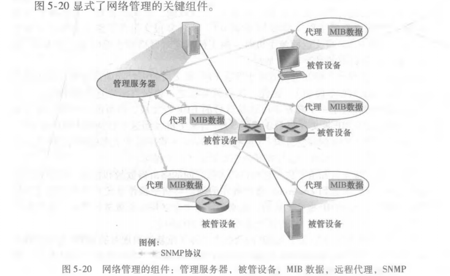

## 网络层：控制平面

1. 概述
2. 路由选择算法
3. 因特网中自治系统内部的路由选择：OSPF
4. ISP 之间的路由选择：BGP
5. SDN 控制平面
6. ICMP：因特网控制报文协议
7. 网络管理和SNMP

控制平面作为一种网络范围的逻辑，不仅控制沿着从源主机到目的主机的端到端路径间的路由器如何转发数据报，而且控制网络层组件和服务如何配置和管理。

### 5.1 概述

在网络控制平面的环境中，转发表（在基于目的地转发的场景中）和流表（在通用转发的场景当中）是链接网络层的数据平面和控制平面的首要元素。这些表定义了一台路由器的本地数据平面转发行为。在通用转发的场景下，所采取的动作不仅包括转发一个分组到达路由器的每个输出端口，而且能够丢弃一个分组，复制一个分组，和/或重写第2、3、4层分组首部字段。

在本章中将学习这些转发表和流表是如何计算、维护和安装的。完成这些工作有两种可能的方法：

- 每路由器控制。下图显示了每台路由器中运行一种路由选择算法的情况，每台路由器都包含转发和路由选择功能，每台路由器都有一个路由选择组件，用于与其它路由器中的路由选择组件通信，以计算其转发表的值。

- 逻辑集中式控制。下图显示了逻辑集中式控制器计算并分发转发表以供每台路由器使用的情况。该控制器经一种定义良好的协议与每台路由器中的一个控制代理(CA)进行交互，以配置和管理该路由器的转发表。CA的任务是与控制器通信并且按控制器的命令行事，这些CA不能直接相互交互，也不能主动参与计算转发表。

### 5.2 路由选择算法

路由选择算法(routing algotithm)的目的是从发送方到接收方的过程中确定一条通过路由器网络的好的路径。通常一条好的路径指具有最低开销的路径。

集中式路由选择算法(centralized routing algorithm)用完整的、全局性的网络知识计算从源到目的地之间的最低开销路径。集中式算法具有关于连通性和链路开销方面的完整信息。具有全局状态信息的算法被称为链路状态(Link State，LS)算法。

分散式路由选择算法(decentralized routing algorithm)中，路由器以迭代、分布式的方式计算出最低开销路径，没有节点拥有关于所有网络链路开销的完整信息。每个节点仅有与其直接相连链路的开销知识即可开始工作，然后通过迭代计算过程以及与相邻节点的信息交换，逐渐计算出到达某目的节点的最低开销路径。距离向量(Distance-Vector，DV)算法是其中的一种。

路由选择算法的第二种广义分类方式是根据算法是静态的还是动态的进行分类。在静态路由选择算法(static routing algorithm)中，路由随时间的变化非常缓慢，通常是人工进行调整。动态路由选择算法(dynamic routing algorithm)随着网络流量负载或拓扑发生变化而改变路由选择路径。

路由选择算法的第三种分类方式是根据它是负载敏感的还是负载迟钝的进行划分。在负载敏感算法(load-sensitive algorithm)中，链路开销会动态的变化以反映出底层链路的当前拥塞水平。当今的因特网路由选择算法都是负载迟钝(load-insensitive)的，因为某条链路的开销不明确地反映其当前的拥塞水平。

#### 5.2.1 链路状态路由选择算法

链路状态算法是一种使用全局信息的算法，在链路状态算法中，网络拓扑和所有的链路开销都是已知的，也就是说可以用作 LS算法的输入。实践中这是通过让每个节点向网络中所有其它节点广播链路状态分组来完成的，其中每个链路状态分组包含它所连接的链路的标识和开销。节点广播的结果是所有节点都具有该网络的统一、完整的视图，于是每个节点都能够像其它节点一样，运行 LS算法并计算出相同的最低开销路径集合。

一个链路状态路由选择算法是 Dijkstra算法，一个密切相关的算法是 Prim算法。

#### 5.2.2 距离向量路由选择算法

距离向量算法是一种迭代的、异步的、分布式的算法。分布式的是因为每个节点都要从一个或多个直接相连的邻居接收某些信息，执行计算，然后将其计算结果分发给邻居，跌打的是因为此过程一直持续到邻居之间无更多信息要交换为止，异步的是因为它不要求所有节点相互之间步伐一致的操作。

### 5.3 因特网中自治系统内部的路由选择：OSPF

上述算法将网络只看作一个互联路由器的集合，从所有路由器执行相同的路由选择算法以计算穿越整个网络的路由选择路径的意义上来说，一台路由器很难同另一台路由器区别开来。在实践中有两个问题：路由器的规模变得庞大，涉及路由选择通信、计算和存储的开销将高得不可实现；因特网是 ISP的网络，其中 ISP都有自己的路由器网络，ISP通常希望按自己的意愿运行它的路由器网络，或对外隐藏其网络的内部组织面貌。

这两个问题可以通过将路由器组织进自治系统(Autonomous System，AS)来解决，其中每个 AS由一组通常处在相同管理控制下的路由器组成。在相同 AS中的路由器都运行相同的路由选择算法并且有彼此的信息，在一个自治系统内运行的路由选择算法叫做自治系统内部路由选择协议(intra-autonomous system routing protocol)。

开放最短路优先(OSPF)路由选择协议及其关系密切的协议 IS-IS都被广泛用于因特网的 AS内部路由选择。OSPF是一种链路状态协议，它使用洪泛链路状态信息和 Dijkstra最低开销路径算法。使用 OSPF时，路由器向自治系统内所有其它路由器广播路由选择信息，每当一条链路的状态发生变化时，路由器就会广播链路状态信息。

OSPF的优点包括：安全、多条相同开销的路径、对单播和多播路由器选择的综合支持、支持在单个AS中的层次结构。

### 5.4 ISP 之间的路由选择：BGP

OSPF是一个 AS内部路由选择协议，当在相同 AS内部的源和目的地之间进行分组选路时，分组遵循的路径完全由 AS内路由选择协议所决定。然而，当分组跨越多个 AS进行路由时，需要一个自治系统间路由选择协议(inter-autonomous system routing protocol)。因为 AS间路由选择协议涉及多个 AS之间的协调，AS通信必须运行相同的 AS间路由选择协议。在因特网中，所有的 AS运行相同的 AS间路由选择协议，称为边界网关协议(Broder Gateway Protocol，BGP)。BGP是一种分布式和异步的协议。

#### 5.4.1 BGP 的作用

每台路由器有一张转发表，对于位于相同 AS中的目的地而言，在路由器转发表中的表项由 AS内部路由选择协议所决定，而对于位于该 AS外部的目的地而言由 BGP处理。

在 BGP中，分组并不是路由到一个特定的目的地址，相反是路由到 CIDR（无类别域间路由选择(Classless Inlerdomain Routing)，因特网的地址分配策略）化的前缀，其中每个前缀表示一个子网或一个子网的集合。在 BGP的世界中，一个目的地址可以采用 aaa.bb.cc/dd的形式，因此一台路由器的转发表将具有形式为（x，I）的表项，其中 x是一个前缀，I是该路由器的接口之一的接口号。

作为一种 AS间的路由选择协议，BGP为每台路由器提供了一种完成以下任务的手段 ：从邻居AS 获得前缀的可达性信息，BGP允许每个子网向因特网的其余部分通告它的存在；确定到该前缀的最好的路由。

#### 5.4.2 通告BGP路由信息

对于每个AS，每台路由器要么是一台网关路由器(gateway router)，要么是一台内部路由器(internal router)。网关路由器是一台位于 AS边缘的路由器，它直接连接到在其它AS
中的一台或多台路由器。内部路由器仅连接在它自己AS中的主机或路由器。

考虑这样一个任务：向上图中显示的所有路由器通告对于前缀x 的可达性信息。首先，AS3向 AS2发送一个 BGP报文，告知 x存在并且位于 AS3中，将该报文表示为 "AS3 x"，然后 AS2向 AS1发送一个 BGP报文，告知 x存在并且能够先通过 AS2然后进入 AS3进而到达 x，将该报文表示为 "AS2 AS3 x"。以这种方式，每个自治系统不仅知道 x的存在，而且知道通向 x的自治系统的路径。

在 BGP中，每对路由器通过使用 179端口的半永久 TCP连接交换路由选择信息，每条直接连接以及所有通过该连接发送的 BGP报文称为 BGP连接，跨越两个 AS的 BGP连接称为外部BGP(eBGP)连接，在相同 AS中的两台路由器之间的 BGP会话称为内部BGP(iBGP)连接。

#### 5.4.3 确定最好的路由

从一个给定的路由器到一个目的子网可能有多条路径，一台路由器如何在这些路径之间进行选择。

当路由器通过 BGP连接通告前缀时，它在前缀中包括一些 BGP属性，用 BGP术语来说，前缀及其属性称为路由(route)。两个较为重要的属性是 AS-PATH和 NEXT-HOP，AS-PATH属性包含了通告已经通告的 AS列表，NEXT-HOP 是 AS-PATH起始的路由器接口的 IP地址。

1. 热土豆路由选择
2. 路由选择算法

#### 5.4.4 IP任播

除了作为因特网的 AS间路由选择协议外，BGP还常被用于实现 IP任播服务，该服务通常用于 DNS中。

#### ~~5.4.5 路由选择策略~~

#### ~~5.4.6 拼装在一起：在因特网中呈现~~

### 5.5 SDN 控制平面

SDN控制平面即控制分组在网络的 SDN使能设备中转发的网络范围逻辑，以及这些设备和它们的服务的配置和管理。SDN体系结构具有 4个关键特征：

- 基于流的转发。SDN控制的交换机的分组转发工作能够基于运输层、网络层或链路层首部中任意数量的首部字段值进行。这与基于路由器转发的传统方法不同，传统方法中 IP数据报的转发仅依据数据报中的目的IP地址进行。
- 数据平面与控制平面分离。数据平面由网络交换机组成，交换机是相对简单但快速的设备，该设备在它们的流表中执行“匹配加动作”的规则。控制平面由服务器以及决定和管理交换机流表的软件组成。
- 网络控制功能：位于数据平面交换机外部。SDN控制平面由软件实现，这个软件在服务器上执行。控制平面由两个组件组成：一个 SDN控制器，维护网络的状态信息，以及若干网络控制应用程序。
- 可编程的网络。通过运行在控制平面中的网络控制应用程序，该网络是可编程的。

SDN表示了一种意义重大的网络功能的分类，即数据平面交换机、SDN控制器和网络控制应用程序是分离的实体

#### 5.5.1 SDN控制平面：SDN控制器和 SDN网络控制应用程序

SDN控制平面大体划分为两个部分，即 SDN控制器和 SDN网络控制应用程序。SDN控制器的功能大体组织为三个层次：

- 通信层：SDN控制器和受控网络设备之间的通信。控制器和受控设备之间的通信跨越了一个控制器的“南向”接口。
- 网络范围状态管理层。由 SDN控制平面所作出的最终控制决定，如配置所有交换机的流表，控制决定将要求具有有关网络的主机、链路、交换机和其它 SDN控制设备的最新状态信息。
- 对于网络控制应用程序层的接口。控制器通过它的“北向”接口与网络控制应用程序交互。该 API允许网络控制应用程序在状态管理层之间读/写网络状态和流表。

#### 5.5.2 OpenFlow 协议

OpenFlow协议运行在 SDN控制器和 SDN控制的交换机或其它实现的设备之间。OpenFlow协议运行在 TCP之上。从控制器到受控交换机流动的重要报文有：配置、修改状态、读状态、发送分组、流删除、端口状态、分组入。

#### ~~5.5.3 数据平面和控制平面交互的例子~~

### 5.6 ICMP：因特网控制报文协议

因特网控制报文协议(ICMP)被主机和路由器用来彼此沟通网络层的信息。ICMP通常被认为是 IP的一部分，但从体系结构上将它位于 IP之上，因为 ICMP报文是承载在 IP分组中的。

### 5.7 网络管理和SNMP

网络管理：包括了硬件、软件和人类元素的设置、综合和协调，以监视、测试、轮询、配置、分析、评价和控制网络即网元资源，用合理的成本满足实时性、运营性能和服务质量的要求。

#### 5.7.1 网络管理框架

#### 5.7.2 简单网络管理协议

简单网络管理协议(Simple Network Management Protocol，SNMP)是一个应用层协议，用于在管理服务器和代表管理服务器执行的代理之间传递网络管理控制和信息报文。
