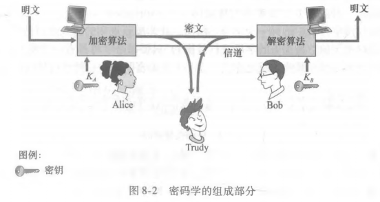
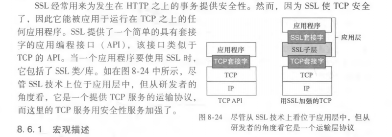
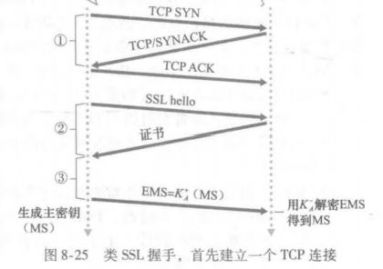
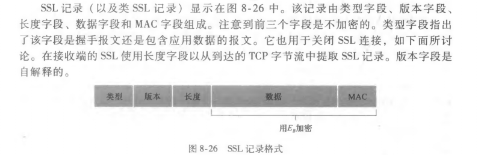
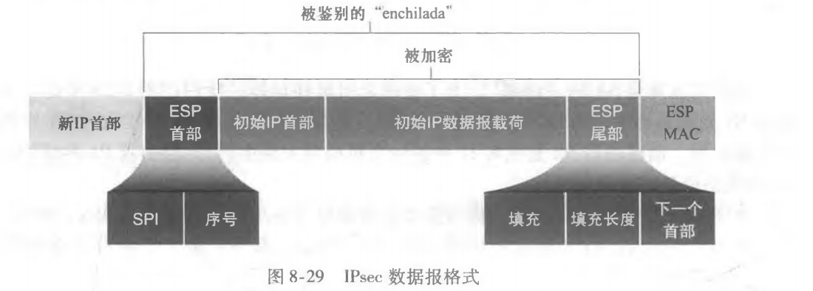

## 计算机网络中的安全

1. 什么是网络安全
2. 密码学的原则
3. 报文完整新和数字签名
4. 端点鉴别
5. 安全电子邮件
6. 使 TCP连接安全：SSL
7. 网络层安全性：IPsec 和虚拟专用网
8. 使无线LAN 安全
9. 运行安全性：防火墙和入侵检测系统

### 8.1 什么是网络安全

安全通信(secure communication)具有以下所需要的特性：

- 机密性(confidentiality)。仅有发送方和希望的接收方能够理解传输报文的内容，这必须要求报文在一定程度上进行加密(encrypted)。
- 报文完整性(message integrity)。通信内容在传输过程中未被改变。
- 端点鉴别(end-port authentication)。发送方和接收方都应该能证实通信所涉及的另一方，以确信通信的另一方确实具有其所声称的身份。
- 运行安全性(operational security)。防火墙和入侵检测系统等运行设备用于反制外界对机构网络的攻击。

入侵者能够潜在的执行下列行为：

- 窃听。监听并记录信道上传输的控制报文和数据报文。
- 修改、插入或删除报文或报文内容。

### 8.2 密码学的原则

密码技术使得发送方可以伪装数据，是入侵者不能从截取到的数据中获得任何信息。

密钥(key)是一串数字或字符，作为加密算法和解密算法的输入。在对称密钥系统(symmetric key system)中，Alice和Bob的密钥是相同的并且是秘密的。在公开密钥系统(public key system)中，使用一对密钥，一个密钥为他们二人所知，另一个密钥只有他们二者之一知道。

#### 8.2.1 对称密钥密码体制

对称加密技术有两种宽泛的类型：流密码(stream cipher)和块密码(block cipher)。

1. 块密码

在块密码中，要加密的报文被处理为 k比特的块，每块被独立加密。为了加密一个块，密码采用一对一映射。

DES(Data Encryption standard，数据加密标准)，AES(Advanced Encryption Standard，高级加密标准)。

#### 8.2.2 公开密钥加密

假设发送方和接收方要进行通信，接收方有两个密钥，一个是所有人都可得到的公钥(pubic key)，一个是只有接收方知道的私钥(private key)。

RAS算法；会话密钥；RAS工作原理。

### 8.3 报文完整性和数字签名

报文完整性也成为报文鉴别。为了鉴别某个报文，接收方需要证实：这个报文来自正确的发送方；报文在传输的途中没有被篡改。

#### 8.3.1 密码散列函数

散列函数以 m为输入，并计算得到一个称为散列的固定长度的字符串 H(m)。因特网检验和（第三章）和CRC（第六章）都满足这个要求。密码散列函数(cryptographic hash function)要求附加以下性质：找到任意两个不同的报文x、y使得 H(x)=H(y)，在计算上是不可能的。

#### 8.3.2 报文鉴别码

为了执行报文完整性，除了使用密码散列函数外，发送方和接收方都需要共享秘密s。这个共享的秘密只不过是一个比特串，它被称为鉴别密钥(authentication key)。

报文完整性能够执行如下：发送方生成报文m，用s级联m 以生成 m+s，并计算散列 H(m+s)。H(m+s)被称为报文鉴别码(Message Authentication Code，MAC)；然后发送方将 MAC附加到报文m上，生成扩展报文(m,H(m+s))，并将该扩展报文发送给接收方；接收方接收到一个扩展报文(m,h)，由于知道s，计算出报文鉴别码H(m+s)，如果H(m+s)=h，则一切正常。

#### 8.3.3 数字签名

一个人的签名证明某些东西属于他，或他承认有他签名的东西的内容。数字签名(digital signature)是一种在数字领域实现这些目标的密码技术。数字签名应当以一种可鉴别、不可伪造的方式进行。

数字签名一个重要的应用是公钥认证(public key certification)，即证实一个公钥属于某个特定的实体。公钥认证用在许多流行的安全网络协议中，包括 IPsec和SSL。

要是公钥密码有用。需要能够证实拥有的公钥是要进行通信的实体的公钥。将公钥与特定实体绑定通常是由认证中心(Certification Authority，CA)完成的，CA的职责是使识别和发行证书合法化。CA具有以下作用：证实一个实体的真实身份；一旦CA验证了某个实体的身份，会为其生成一个将其身份和实体的公钥绑定起来的证书(certificate)，这个证书包含这个公钥和公钥所有者全局唯一的身份标识信息，由CA对这个证书进行数字签名。

### 8.4 端点鉴别

端点鉴别(end-port authentication)是一个实体经过计算机网络向另一个实体证明其身份的过程。路由器、客户/服务器进程等网络元素通常必须相互鉴别。鉴别应当在报文和数据交换的基础上作为某鉴别协议(authentication protocol)的一部分独立完成。鉴别协议通常在两个通信实体运行其它协议之前运行，鉴别协议首先建立互相满意的各方的标识，仅当鉴别完成之后各方才继续后面的工作。

#### ~~8.4.1 鉴别协议 ap~~

### ~~8.5 安全电子邮件~~

#### ~~8.5.1 安全电子邮件~~

#### ~~8.5.2 PGP~~

### 8.6 使 TCP连接安全：SSL

密码技术用安全性服务加强TCP，该安全性包括机密性、数据完整性和端点鉴别。TCP的这种强化版本被称为安全套接字层(Secure Socket Layer，SSL)。

#### 8.6.1 宏观描述

1. 握手

在握手阶段，客户需要：与服务器创建一条TCP连接；验证服务器是真实地服务器；发送给服务器一个主密钥，客户和服务器持有用该主密钥生成SSL会话所需的所有对称密钥。

注意到一旦创建了TCP连接，客户就向服务器发送一个 hello报文。服务器用它的证书进行响应，证书中包含了她的公钥。然后客户产生一个主密钥（MS，将用于这个SSL会话），用服务器的公钥加密该MS以生成加密的主密钥EMS，并将该EMS发送给服务器，服务器用它的私钥解密该EMS从而得到该MS。

2. 密钥导出

从原则上将，MS此时由客户和服务器共享，它能够用作所有后续加密和数据完整性检查的对称会话密钥。然而对客户和服务器而言，使用不同的密码密钥，并且对于加密和完整性检查也使用不同的密钥，因此客户和服务器都是用MS生成4个密钥：Eb：用于从客户发送到服务器的数据的会话加密密钥；Mb：用于从客户发送到服务器的数据的会话MAC密钥；Ea：用于从服务器发送到客户的数据的会话加密密钥；Ma：用于从服务器发送到客户的数据的会话MAC密钥。其中两个加密密钥用于加密数据，两个MAC密钥用于验证数据的完整性。

3. 数据传输

TCP是一种字节流协议，为了验证数据的完整性，SSL将数据流分割成记录，对每个记录附加一个MAC用于完整性检查，然后加密该“记录+MAC”。

4. SSL记录

#### 8.6.2 更完整的描述

1. SSL握手

SSL允许客户和服务器在握手阶段在SSL会话开始时就密码算法取得一致，此外，在握手阶段，客户和服务器彼此发送不重数，该数被用于会话密钥(Eb,Mb,Ea,Ma)的生成中。真正的SSL握手的步骤如下：
1）客户发送它支持的密码算法选择列表，连同一个客户的不重数；
2）从该列表中服务器选择一种对称算法、一种公钥算法和一种MAC算法，它把它的选择以及证书和一个服务器不重数返回给客户；
3）客户验证该证书，提取服务器的公钥，生成一个前主密钥(Pre-Master Secret，PMS)，用服务器的公钥加密该PMS，并将加密的PMS发送给服务器；
4）使用相同的密钥到处函数，客户和服务器独立的从PMS和不重数中计算出主密钥(Master Secret，MS)。然后该MS被切片以生成两个密码和两个MAC密钥；
5）客户发送所有握手报文的一个MAC；
6）服务器发送所有握手报文的一个MAC。

~~2. 连接关闭~~

### 8.7 网络层安全性：IPsec 和虚拟专用网

IP安全(IP Security)协议称为IPsec，它为网络层提供了安全性。IPsec为任意两个网络层实体（包括主机和路由器）之间的 IP数据报提供安全。许多机构使用IPsec创建了运行在公共因特网之上的虚拟专用网(Virtual Private Network, VPN)。

在网络实体对之间（如两台路由器之间、两台主机之间、或路由器和主机之间）具有网络层机密性，发送实体加密它发送给接收实体的所有数据报的载荷，这种载荷可以是一个TCP报文段、一个UDP报文段、一个ICMP报文段等。

除了机密性，网络层安全协议潜在地能够提供其它安全性服务。如它能提供源鉴别，使得接收实体能够验证安全数据报地源；网络层安全协议能够提供数据完整性，使得接收实体能够核对在数据报传输过程中可能出现地任何篡改；网络层安全服务能够提供防止重放攻击功能。

#### 8.7.1 IPsec 和虚拟专用网

跨越在多个地理区域上的机构常常希望有自己的IP网络，使它的主机和服务器能够以一种安全和机密的方式彼此发送数据，为此，该机构需要实际部署一个单独的物理网络，该网络包括路由器、链路和DNS基础设施，且与公共因特网完全分离。这种为特定的机构专用的分立网络被称为专用网络(private network)。

不同于部署一个专用网络，许多机构在现有的公共因特网上创建VPN。使用VPN，机构办公室之间的流量经公共因特网而不是物理上独立的网络发送。为了提供机密性，办公室之间的流量在进入公共因特网之间进行加密。

当机构的A向处于另一个位置的B发送一个IP数据报时，A所处的网关路由器将经典的IPv4数据报转换成IPsec数据报，然后将该IPsec数据报转发进因特网。该IPsec数据报实际上具有传统的IPv4首部，因此在公共因特网中的路由器处理该数据报的方式和处理一个普通的IPv4数据报相同。IPsec数据报的载荷包括一个IPsec首部，该首部被用于IPsec处理，此外，IPsec数据报的载荷是被加密的。当该IPsec数据报到达B的主机时，操作系统将解密载荷（并提供其它安全服务），并将解密的载荷传递给上层协议。

#### 8.7.2 AH协议和 ESP协议

IPsec的协议族中有两个主要协议：鉴别首部(Authentication Header, AH)协议和封装安全性载荷(Encapsulation Security Payload, ESP)协议。当某源IPsec实体向另一个目的实体发送安全数据报时，可以使用AH协议或者ESP协议来达到目的。AH协议提供源鉴别和数据完整性服务，但不提供机密性服务；ESP协议提供源鉴别、数据完整性和机密性服务。

#### 8.7.3 安全关联

IPsec数据报在网络层实体之间发送，在从源实体向目的实体发送IPsec数据报之前，源和目的实体会创建一个网络层的逻辑连接，这个逻辑连接被称为安全关联(Security Association, SA)。一个SA是一个单工逻辑连接，即它是从源到目的之间单向的。如果两个实体要互相发送安全数据报，则需要创建两个SA。

发送端路由器将维护SA的状态信息，包括：SA的32比特的标识符，被称为安全参数索引(Security Parameter Index, SPI)；SA的初始接口和目的接口；使用的加密类型；加密密钥；完整性检查的类型；鉴别密钥。无论何时发送端路由器需要构建一个IPsec数据报经过这个SA转发，它访问该状态信息以决定它应当如何鉴别和加密该数据报。

#### 8.7.4 IPsec数据报

IPsec有两种不同的分组形式：隧道模式(tunnel mode)和运输模式(transport mode)。前者部署更广泛。

路由器经过下列步骤将一个IPv4数据报转换成一个IPsec数据报：

- 在初始IPv4数据报后面附加一个“ESP尾部”字段（得到结果1）
- 使用算法和由SA规定的密钥加密结果1（得到结果2）
- 在结果2前面附加一个称为“ESP首部”的字段（得到结果3）
- 使用算法和由SA规定的密钥生成一个覆盖整个结果3的鉴别MAC
- 将该MAC附加到结果3后面形成载荷
- 最后生成一个具有经典IPv4首部字段的全新IP首部，将新首部附加到载荷之前。

#### 8.7.5 IKE：IPsec中的密钥管理

一个IPsec实体通常维护许多SA的状态信息，当实体过多时，IPsec使用因特网密钥交换(Internet Key Exchange, IKE)协议来自动生成SA。

每个IPsec实体具有一个证书，该证书包括了该实体的公开密钥，IKE协议让两个实体交换证书，协商鉴别和加密算法，并安全的交换用于在IPsec SA中生成会话密钥的密钥材料。

### 8.8 使无线LAN 安全

#### 8.8.1 有线等效保密

有线等效保密(Wired Equivalent Privacy, WEP)意欲在无线网络中提供类似于在有线网络中的安全性水平。

#### 8.8.2 IEEE 802.11i

802.11i运行分为四个阶段：

- 发现：通告存在和提高鉴别与加密形式。
- 相互鉴别和主密钥(MK)生成。
- 成对主密钥(Pairwise Master Key, PMK)生成。
- 临时密钥(Temporal Key, TK)生成。

### 8.9 运行安全性：防火墙和入侵检测系统

在计算机网络中，当通信流量进入/离开网络时要执行安全检查、记录、丢弃或转发，这些工作由防火墙、入侵检测系统(IDS)和入侵防止系统(IPS)来完成。

#### 8.9.1 防火墙

防火墙(firewall)是一个硬件和软件和结合体，它将一个机构的内部网络与整个因特网隔离开，允许一些数据分组通过并且阻止另一些分组通过。防火墙允许网络管理员控制外部和被管理网络内部资源之间的访问，这种控制是通过管理流入和流出这些资源的流量实现的。防火墙具有三个目标：

- 从外部到内部和从内部到外部的所有流量都通过防火墙。
- 仅被授权的流量（由本地安全策略定义）允许通过。
- 防火墙自身免于渗透。

防火墙能够分为三类：传统分组过滤器（traditional packet filter）、状态过滤器（stateful filter）、应用程序网关（application gateway）。

1. 传统的分组过滤器

一个机构通常都有一个将其内部网络与其ISP相连的网关路由器（并因此与更大的公共因特网相连），所有离开和进入内部网络的流量都要经过这个路由器，这个路由器正是分组过滤发生的地方。分组过滤器独立的检查每个数据报，然后基于管理员特定的规则决定该数据报是允许通过还是被丢弃。过滤决定通常基于这些因素：IP源或目的地址、在IP数据报中协议类型字段、TCP或UDP的源和目的的端口号、TCP标志比特、ICMP报文类型、以及自定义配置的规则。

2. 状态分组过滤器

传统的分组过滤器根据每个分组独立的做出过滤决定，状态过滤器实际的跟踪TCP连接并做出过滤决定。防火墙能够通过观察三次握手（SYN、SYNACK、ACK）来观察一条新连接的开始，而且当它看到该连接的一个FIN分组时，它能够观察该连接的结束。状态过滤器通过检测连接的状态，并用一张连接表来跟踪所有进行中的TCP连接，从而只让有效的TCP连接的分组通过。

3. 应用程序网关

前两种过滤依据的条件是分组或连接的信息，对应的是传输层和网络层。假设现在要验证机构内部的用户的身份，这是应用层数据，并不包括在IP/TCP/UDP首部中。为了得到更高水平的安全性，防火墙必须把分组过滤器和应用程序网关结合起来，应用程序网关除了检测IP/TCP/UDP首部外，还基于应用数据来做策略决定。一个应用程序网关是一个应用程序特定的服务器，所有应用程序数据都必须通过它。

#### ~~8.9.2 入侵检测系统和入侵防止系统~~
